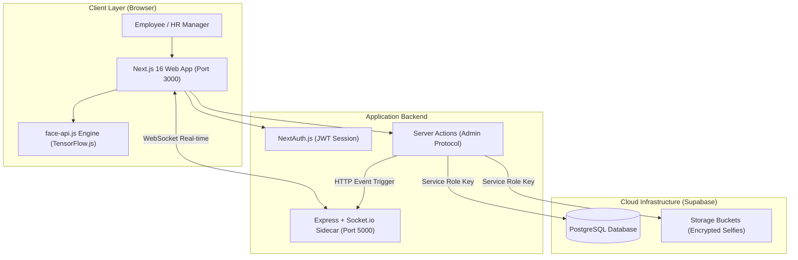

<div align="center">

# 🏢 Smart HRMS & Selfie Recognition

### Next-Gen Enterprise Human Resource Management System with AI Biometrics, Geofencing & Performance Optimization

[](https://github.com/andrieanugrah/Smart-HRMS-Selfie-Recognition/actions/workflows/ci.yml)
[](https://nextjs.org/)
[](https://react.dev/)
[](https://www.typescriptlang.org/)
[](https://expressjs.com/)
[](https://supabase.com/)
[](https://tailwindcss.com/)
[](LICENSE)

[**English Guide**](#-english) &nbsp;|&nbsp; [**Panduan Bahasa Indonesia**](#-bahasa-indonesia)

</div>

---

<a name="english"></a>
## 🌐 English

### 📌 System Overview

**Smart HRMS & Selfie Recognition** is a production-grade, enterprise Human Resource Management System engineered with modern web technologies. It combines client-side AI biometric facial recognition, real-time geolocation radius validation, atomic leave and overtime approval workflows, and instant WebSocket notifications into a unified monorepo application.

---

### ⚡ Performance, SSR & SEO Architecture

The system has undergone a full senior-level fullstack audit and optimization suite to achieve top-tier Core Web Vitals, optimal SEO indexing, and minimal initial JavaScript bundle size.

#### 🎯 Key Performance Optimizations
1. **Dynamic Code Splitting & Dynamic Imports**:
   - **XLSX Module Lazy Loading**: The ~500KB `xlsx` spreadsheet generation engine is lazily fetched (`await import('xlsx')`) only when an export is triggered.
   - **Face-API Lazy Loading**: `face-api.js` and TensorFlow model weights are loaded dynamically on demand during camera initialization, keeping initial entry bundles ultra-lean.
   - **Isolated Canvas/Recharts Charting**: Client-side window dependent charting (`recharts`) is dynamically imported (`ssr: false`), preventing hydration mismatches and rendering stalls.
2. **SSR & Streaming Hydration**:
   - Dashboard layouts (`HRDBento` & `EmployeeBento`) render via Server-Side Rendering (SSR) for instant first contentful paint (FCP), avoiding full-page client skeleton blinks.
3. **SEO Engine & PWA Compliance**:
   - Dynamic `robots.ts` route emitting `/robots.txt`.
   - Dynamic `sitemap.ts` generator emitting `/sitemap.xml`.
   - Dynamic `manifest.ts` creating `/manifest.webmanifest` for mobile PWA readiness.
   - Structured metadata with OpenGraph, Twitter Cards, keywords, and dynamic page title templates.
4. **Bundle & Package Tree-Shaking**:
   - Next.js `optimizePackageImports` configured for Lucide, Radix UI, Date-fns, Framer Motion, and Phosphor Icons.
   - HTTP Security Headers (X-Frame-Options, X-Content-Type-Options, Referrer-Policy) and Brotli compression enabled.
   - Production console logging stripping enabled.

---

### 🏗️ Architecture & System Design

The project follows a modular **npm workspace monorepo** architecture powered by Next.js 16 App Router, an Express + Socket.io sidecar server for low-latency real-time events, and Supabase for backend storage, authentication, and database security.



---

### 📂 Monorepo Structure

```text
Smart-HRMS-Selfie-Recognition/
├── .github/
│   └── workflows/
│       └── ci.yml               # GitHub Actions CI pipeline configuration
├── apps/
│   ├── web/                     # Next.js 16 Frontend App Router (Port 3000)
│   │   ├── public/models/       # face-api.js TensorFlow weight shards & manifests
│   │   └── src/
│   │       ├── app/             # App Router pages, metadata, robots, sitemap
│   │       ├── components/      # UI components (Radix UI, Tailwind v4, Lucide)
│   │       └── lib/             # Face API engine, crypto, hooks, Supabase clients
│   └── server/                  # Express + Socket.io Sidecar Server (Port 5000)
│       └── src/                 # Routes, controllers, and socket namespaces
├── packages/
│   └── shared/                  # Monorepo shared package (Types, Constants, Timezone)
├── database/
│   ├── schema.sql               # PostgreSQL DDL, RLS policies & Storage bucket DDL
│   ├── schema_v2.sql            # Schema migration extensions
│   ├── seed.sql                 # Starter roles & profile seeds
│   └── cleanup.sql              # Database reset utility
└── .env.example                 # Environment variables master template
```

---

### ✨ Key Features

#### 🧑‍💼 Employee Portal (`/employee/*`)
- **AI Biometric Selfie Attendance**: Clock-in and clock-out with real-time 128-dimensional facial descriptor vector matching.
- **Geofencing Radius Check**: Validates user location against office coordinates (`OFFICE_LAT`, `OFFICE_LNG`, `OFFICE_RADIUS_METERS`) using the Haversine distance formula.
- **Leave Request Management**: Annual and sick leave submission with automatic business-day calculation, weekend exclusion, and quota validation.
- **Overtime Tracking**: Submit overtime hours with task justification and check approval status in real time.
- **Biometric Profile Registration**: Self-register and update facial biometric descriptors directly from the user profile.

#### 👨‍💼 HRD & Admin Portal (`/hrd/*`)
- **Real-Time Analytics Dashboard**: Live daily attendance statistics, punctuality breakdown, department distribution, and pending approval queues.
- **Selfie Proof Audit Logs**: Review clock-in/out selfie photo proof, match confidence percentage, and timestamps.
- **Atomic Approval Management**: Process leave and overtime requests with race-condition prevention and instant status emission.
- **Employee Administration**: Manage user roles, departments, employment status, and trigger facial descriptor resets.
- **Exportable Payroll & Reports**: Generate audit logs, department summaries, and employee payslips (XLSX lazy export).

---

### 🔒 Biometric Privacy & Security Ethics

1. **Client-Side Biometric Processing**: Raw video feeds and camera streams never leave the user's browser. Facial feature extraction is executed locally using TensorFlow.js.
2. **Encrypted Facial Descriptors**: 128-dimensional biometric vectors are encrypted using AES-256-GCM before persistent database storage.
3. **Selfie Encrypted Storage**: Selfie verification photos uploaded to Supabase Storage buckets are secured via fine-grained access policies.
4. **Service-Role Server Action Isolation**: Database mutations execute through isolated server actions with server-side authorization guards (`requireRole`, `requireUser`).

---

### ⚙️ Prerequisites & Environment Setup

#### Required Runtime Tools
- **Node.js**: v18.x or v20.x (v20 Recommended)
- **npm**: v9.x or v10.x

#### Environment Variables Configuration

Copy `.env.example` to root `.env` and `apps/web/.env.local`:

```bash
cp .env.example .env
cp .env.example apps/web/.env.local
```

| Variable Name | Description | Default / Example |
| :--- | :--- | :--- |
| `NEXT_PUBLIC_SUPABASE_URL` | Supabase Project URL | `https://your-project.supabase.co` |
| `NEXT_PUBLIC_SUPABASE_ANON_KEY` | Supabase Anonymous Client Key | `eyJhbGci...` |
| `SUPABASE_SERVICE_ROLE_KEY` | Supabase Secret Service Role Key | `eyJhbGci...` |
| `NEXTAUTH_SECRET` | NextAuth JWT Encryption Key | `random-32-byte-secret` |
| `NEXTAUTH_URL` | Web App Canonical Base URL | `http://localhost:3000` |
| `INTERNAL_SOCKET_SECRET` | Secret header for Server-to-Socket communication | `super-secret-internal-token` |
| `SOCKET_INTERNAL_URL` | Server-side Socket HTTP endpoint | `http://localhost:5000` |
| `NEXT_PUBLIC_SOCKET_URL` | Client-side Socket Connection URL | `http://localhost:5000` |
| `SERVER_PORT` | Express Sidecar Server Port | `5000` |
| `FACE_MATCH_THRESHOLD` | Max Euclidean Distance for face matching | `0.6` (Lower = Stricter) |
| `FACE_ENCRYPTION_KEY` | Secret key for 128-d descriptor AES encryption | `32-character-secret-key` |
| `OFFICE_LAT` | Office Latitude coordinate | `-6.200000` |
| `OFFICE_LNG` | Office Longitude coordinate | `106.816666` |
| `OFFICE_RADIUS_METERS` | Max allowed distance radius in meters | `100` |

---

### 🚀 Quick Start Guide

#### 1. Install Workspace Dependencies
> [!IMPORTANT]
> Always use `--legacy-peer-deps` due to React 19 peer dependency declarations across legacy packages.

```bash
npm install --legacy-peer-deps
```

#### 2. Provision Database & Storage
Open your **Supabase SQL Editor** and execute the contents of:
- [`database/schema.sql`](database/schema.sql) (Creates DDL schemas, trigger functions, RLS policies, and `selfies` storage bucket).

#### 3. Seed Starter Demo Users
Run the user seeding script to create initial HRD and Employee accounts:

```bash
npm run seed:users
```

*Created Demo Accounts:*
- 👨‍💼 **HR Manager**: `hr@company.com` / `123456`
- 🧑‍💼 **Employee**: `employee@company.com` / `123456`

#### 4. Run Development Servers

**Option A — Next.js Web App Only (Port 3000):**
```bash
npm run dev
```

**Option B — Real-time Express Server Only (Port 5000):**
```bash
npm run dev:server
```

#### 5. Production Build & Quality Checks

Validate monorepo workspace compilation:

```bash
npm run build        # Builds shared package, web app, and express server
npm run lint         # Executes Next.js linting across apps/web
```

---

<a name="bahasa-indonesia"></a>
## 🇮🇩 Bahasa Indonesia

### 📌 Ringkasan Sistem

**Smart HRMS & Selfie Recognition** adalah sistem informasi manajemen sumber daya manusia (HRMS) tingkat enterprise. Aplikasi ini mengintegrasikan presensi wajah berbasis AI pada sisi klien (*client-side AI biometrics*), validasi radius lokasi geofencing secara real-time, manajemen cuti & lembur dengan transaksi atomik, serta notifikasi instan berbasis WebSocket dalam arsitektur monorepo modern.

---

### ⚡ Audit Performa & Optimasi SEO/SSR

Sistem telah diaudit secara menyeluruh oleh Senior Fullstack Developer untuk mencapai performa Core Web Vitals optimal dan kesiapan rilis produk:

1. **Optimasi Bundle & Dynamic Import**:
   - Modul `xlsx` (~500KB) di-load secara *lazy/async* saat user mengunduh laporan.
   - Pustaka `face-api.js` dan bobot model TensorFlow hanya diunduh saat kamera presensi aktif.
   - Komponen chart visualizer (`recharts`) diisolasi dengan *dynamic import* untuk mencegah kendala window SSR.
2. **SSR Layout & Rendering Fast Paint**:
   - Layout dashboard (`HRDBento` & `EmployeeBento`) menggunakan *Server-Side Rendering* (SSR) untuk First Contentful Paint (FCP) yang instan.
3. **Mesin SEO & Kesiapan PWA**:
   - Generasi otomatis `robots.txt` via `robots.ts`.
   - Generasi otomatis `sitemap.xml` via `sitemap.ts`.
   - Metadata PWA `/manifest.webmanifest` via `manifest.ts`.
   - Metadata lengkap OpenGraph & Twitter Cards pada seluruh halaman.
4. **HTTP Security Headers & Compression**:
   - Integrasi HTTP security headers (X-Frame-Options, X-Content-Type-Options, Referrer-Policy) dan kompresi gzip/brotli.

---

### 🛠️ Teknologi Utamanya

- **Frontend**: Next.js 16 (App Router), React 19, Tailwind CSS v4, Framer Motion, Lucide Icons.
- **Backend Realtime**: Express.js + Socket.io (Sidecar Server).
- **Database & Otentikasi**: Supabase (PostgreSQL, Auth, Storage) + NextAuth.js (JWT Strategy).
- **Face Recognition**: face-api.js (Client-side TensorFlow.js vector matching).
- **Arsitektur**: Monorepo via npm workspaces (`apps/web`, `apps/server`, `packages/shared`).

---

### ✨ Fitur Utama

#### 🧑‍💼 Portal Karyawan (`/employee/*`)
- **Presensi Selfie Wajah (AI)**: Check-in & Check-out menggunakan pencocokan vektor 128-d deskriptor wajah secara *real-time*.
- **Validasi Geofencing Radius**: Memastikan posisi GPS karyawan berada dalam radius kantor yang diizinkan.
- **Pengajuan Cuti**: Pengajuan cuti tahunan/sakit dengan kalkulasi hari kerja otomatis (menghitung akhir pekan & libur nasional).
- **Pengajuan Lembur**: Pencatatan dan pemantauan status persetujuan jam lembur.
- **Registrasi Biometrik**: Pendaftaran dan pembaruan sampel wajah langsung melalui menu profil.

#### 👨‍💼 Portal HRD & Admin (`/hrd/*`)
- **Dashboard Real-time**: Ringkasan kehadiran harian, statistik keterlambatan, dan antrean persetujuan.
- **Audit Bukti Selfie**: Melihat foto bukti presensi karyawan beserta tingkat akurasi pencocokan biometrik.
- **Manajemen Persetujuan**: Process approval/rejection cuti & lembur secara atomic dengan proteksi *race-condition*.
- **Kelola Karyawan**: Manajemen akun, posisi, departemen, serta fitur reset deskriptor wajah.

---

### 🛡️ Standar Keamanan & Etika Biometrik

1. **Privasi Kamera Karyawan**: Stream kamera dan rekaman video tidak pernah dikirim ke server backend. Seluruh ekstraksi vektor biometrik berjalan 100% lokal di *browser* menggunakan TensorFlow.js.
2. **Enkripsi Vektor Wajah**: Vektor deskriptor wajah 128-d dienkripsi menggunakan AES-256-GCM sebelum disimpan di database.
3. **Akses Berkas Foto Aman**: Foto bukti presensi disimpan pada Supabase Storage dengan kebijakan otorisasi terisolasi.

---

### 📄 Lisensi & Kontribusi

Proyek ini dilindungi di bawah lisensi [MIT License](LICENSE). Kontribusi terbuka melalui *Pull Request* dengan mengikuti standar CI/CD dan etika pengkodean Clean Code.

<div align="center">

Developed with ❤️ by **Andrie Anugrah**

</div>
